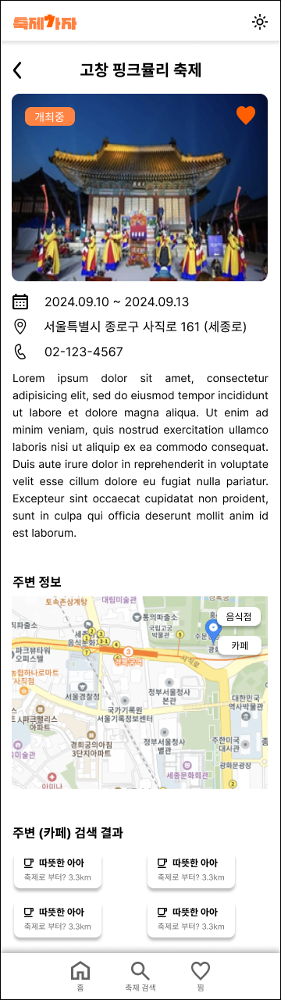

## 진행 단계

모든 페이지 퍼블리싱 완료
<br />

<h3>오늘 한 작업</h3>
<ul>
<li>카카오맵 api key 발급 & detailPage에 지도 불러오기</li>
<li>한국 관광공사 api의 contentid와 카카오맵 api의 위도, 경도 정보 연결하여 해당 축제 위치 마커로 노출하기</li>
<li>축제 상태(진행중, D-일수, 종료)를 3가지로 나타내기 위해서 "진행중인 행사", "개최 예정인 행사", "종료된 행사" 필터링이 필요할 것 같아 버튼 ui 추가하고 오늘 날짜로부터 api response 변수인 eventstartdate, eventenddate 계산하여 값 비교 후 상태 띄우기</li>
<li>이미지가 null인 경우 로고 이미지로 대체</li>
<li>글이 길어질 경우 detailPage가 상단부터 안보이고 중간부터 보이는 문제를 해결하기 위해 useEffect에 window.scrollTo(0,0) 적용</li>
</ul>
<h3>내일 할 일</h3>
<ul>
<li>헤더 지역 클릭하면 클릭한 지역 코드에 해당하는 카드 리스트만 렌더링</li>
<li>찜한 카드 리스트들만 위시리스트 페이지로 보내기</li>
<li>카드리스트 무한스크롤 적용하기</li>
</ul>
<br />

# 전국의 축제들을 모아놓은 모바일 중심 웹사이트 축제7ㅏ자 (Readme 업데이트 중...)

<br />

## 🎇 프로젝트 소개

축제7ㅏ자는 전국의 다양한 축제를 한곳에 모아놓은 모바일 중심의 웹사이트입니다.
사용자들은 이 웹사이트를 통해 다양한 축제 정보를 쉽게 조회하고, 자신의 관심사에 맞는 축제 정보들을 관리할 수 있습니다.

<br />

## 💡 페이지별 기능 (주요 기능)

- **홈페이지**: 지역 카테고리 메뉴를 이용해 지역별로 개최되는 축제를 찾아볼 수 있습니다.
- **축제 검색**: 지역, 날짜, 키워드 검색을 통해 원하는 축제를 쉽게 검색할 수 있습니다.
- **위시리스트**: 관심 있는 축제를 "찜하기" 버튼을 통해 나만의 위시리스트에 저장해두고, 언제든지 쉽게 찾아볼 수 있습니다.
- **축제 상세 정보**: 축제 카드를 클릭하면 축제의 상세 정보(주소, 설명, 전화번호 등)와 해당 축제 근처에 있는 맛집, 카페 정보도 함께 제공받을 수 있습니다.

<br />

🏠 홈페이지 <br />


🔍 검색 페이지 <br />


📄 상세 페이지 <br />


❤️ 찜목록 페이지 <br />


<br />

## 👷 개발환경

- front: React, tailwind-css, Zustand
- 버전 및 이슈관리: Github, Github Issues
- 디자인: Figma / 기획: Notion

<br />

## 📁 프로젝트 구조

```bash
src
├── assets
│   └── logo.svg
├── store
│   └── 찜목록하트상태관리.js
├── constants
│   └── regionList.js
├── network
│   ├── 공공데이터.js
│   └── 카카오맵.js
├── features
│   ├── HomePage
│   │   ├── components
│   │   │   └── TodayList.jsx
│   │   └── HomePage.jsx
│   ├── SearchPage
│   │   └── SearchPage.jsx
│   ├── CalendarPage
│   │   ├── components
│   │   │   ├── Calendar.jsx
│   │   └── CalendarPage.jsx
│   ├── DetailPage
│   │   ├── components
│   │   │   ├── DetailCard.jsx
│   │   │   ├── MapArea.jsx
│   │   │   ├── Map.jsx
│   │   │   ├── AroundCardList.jsx
│   │   │   └── AroundCard.jsx
│   │   └── DetailPage.jsx
│   └── WishListPage
│       └── WishListPage.jsx
├── components
│   ├── ui
│   │   ├── Button.jsx
│   │   ├── FestivalState.jsx
│   │   └── icon
│   │       ├── index.js
│   │       ├── CallIcon.jsx
│   │       ├── SearchIcon.jsx
│   │       ├── WishIcon.jsx
│   │       ├── CalendarIcon.jsx
│   │       ├── LocationIcon.jsx
│   │       ├── CloseIcon.jsx
│   │       ├── RefreshIcon.jsx
│   │       ├── ExpendIcon.jsx
│   │       ├── HamburgerBarIcon.jsx
│   │       ├── DarkModeIcon.jsx
│   │       ├── TopButtonIcon.jsx
│   │       ├── CafeIcon.jsx
│   │       ├── RestaurantIcon.jsx
│   │       └── DescriptionIcon.jsx
│   ├── Card.jsx
│   ├── CardList.jsx
│   ├── WishListPreview.jsx
│   ├── Header.jsx
│   ├── Footer.jsx
│   ├── SearchBar.jsx
│   └── MoveTop.jsx
```

<br />

## 📆 개발 기간

- 기획: 2024.9,10 ~ 2024.9.25
- 개발: 2024.9.27 ~ ing

<br />

## 🔧 개선 목표

<br />

## 프로젝트 후기

### 프로젝트 중 어려웠던 점과 해결 방법

<details>
  <summary>tailwind-css 설치</summary>
    <div markdown="1">
    <ul>
      <li>작성 예정</li>
      <li></li>
    </ul>
  </div>
</details>
<details>
  <summary>vite + react에서 환경변수 사용</summary>
    <div markdown="2">
    <ul>
      <li>작성 예정</li>
      <li></li>
    </ul>
  </div>
</details>
<details>
  <summary>swiper 라이브러리 대신에 useRef로 슬라이드 구현</summary>
    <div markdown="3">
    <ul>
      <li>작성 예정</li>
      <li></li>
    </ul>
  </div>
</details>
